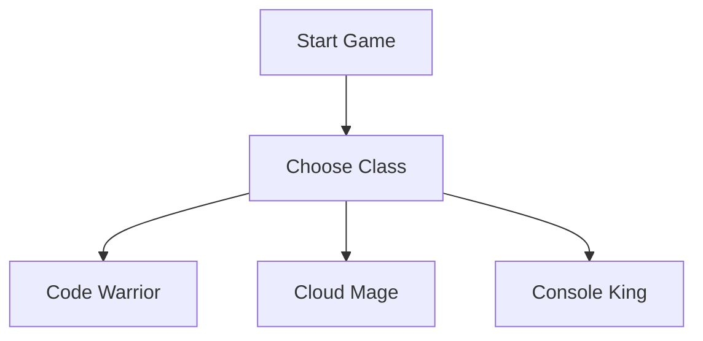
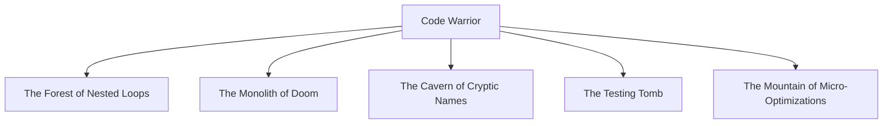
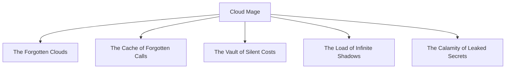
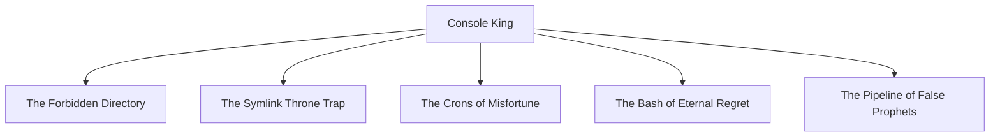
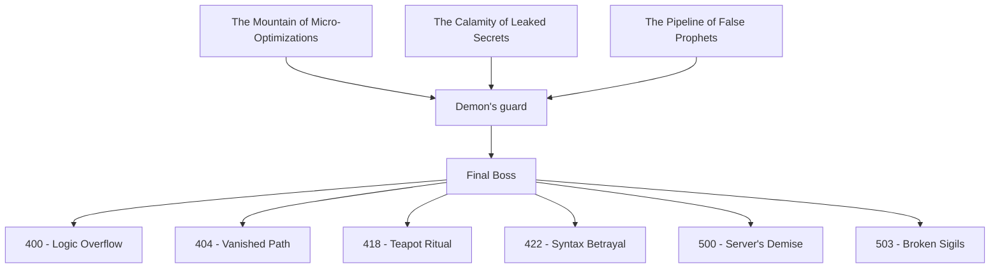
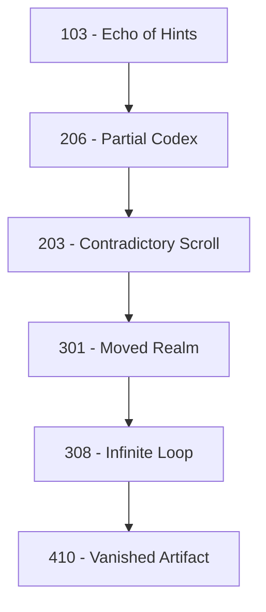

# 📜 100 - The Dev Codex

> _“Long before the Forkstorm, when only static sites roamed free…  
> the first Devs carved their knowledge into runes of structure and flow.  
> This Codex preserves their secrets.”_

### 🕹️ Branches of the Dev Tree


### 🖥️ Route of Code Warrior



### ☁️ Route of Cloude Mage



### 👑 Route of Console King



### ☠️ Final Boss & Aftermath



<!--
### 🏰 Final

```mermaid
graph TD
  Boss[Final Boss]
  Boss -> F7[200 - Deceptive Path]
  Boss -> F8[202 - The True Ending]
```
-->

- The number 100 is the only code in this game that doesn’t represent failure or success — but **knowledge**.
- Some paths may only be fully understood by exploring the `.bashrc`, `prophecy.txt`, or ancient files in `/game/secrets`.
- The Codex is updated with each **artifact unearthed** or **law rewritten**.   

<a href="../boss-cutscene.md">
  
</a>

---

### Knowledge Beyond Victory

- The number `100` is the only code in this game that doesn’t represent failure or success — but **insight**.
- Some truths are buried deep in:
  - `~/.bashrc`
  - `prophecy.txt`
  - `runes.log`
  - 🗝️ And other secrets within `/game/secrets/`
- Only the most curious minds will decipher the full shape of the Forkstorm.

> _"The wisest devs do not seek the quickest route — but the one with the most meaningful exceptions."_ 🧙‍♂️

---

<a href="../boss-cutscene.md">
  
</a>

---

### 🧩 Fractured Runes

Some runes were scattered across the Repoverse.  
Only those who dig past the surface — or misstep gloriously — may find them.



<details> <summary>📜 Whispers the Hacker God did not intend to document...</summary>

- [102 - Processing Rite](./102.md)
- [401 - Unauthorized Spell](./401.md)
- [410 - The Gone Mirror](./410.md)
- [429 - Too Many Pings](./429.md)
- [502 - Broken Gateway](./502.md)
- [507 - Insufficient Dev Runes](./507.md)
- [511 - Forbidden Configs](./511.md)

</details>
